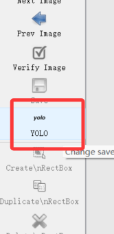
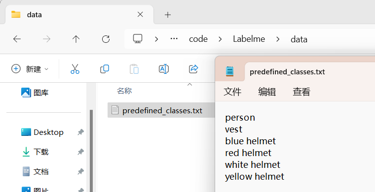
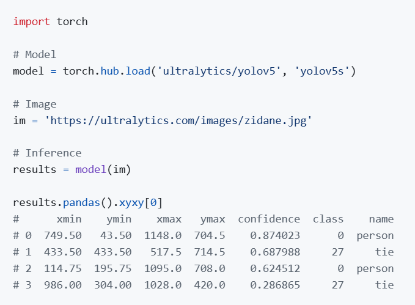

# YOLOv5训练自定义模型

[toc]

## 一、安装Pytorch 及 YOLO v5

### 1.1 安装pytorch GPU版

#### 1.1.1 准备工作

* 先去[pytorch官网](https://pytorch.org/get-started/locally/)查看支持的CUDA版本；

  * 建议配合TensorFlow官网一起参考，以便两个库都可以使用

  * pytorch 

    * 最新版：https://pytorch.org/get-started/locally/
    * 历史版本：https://pytorch.org/get-started/previous-versions/

    

  * Tensorflow ：

    * GPU支持CUDA列表：https://www.tensorflow.org/install/source_windows?hl=zh-cn

      

      

* 再查看所需CUDA版本对应的显卡驱动版本：

  * 参考信息：

    * https://docs.nvidia.com/deploy/cuda-compatibility/index.html#abstract
    * https://docs.nvidia.com/cuda/cuda-toolkit-release-notes/index.html
    * https://tech.amikelive.com/node-930/cuda-compatibility-of-nvidia-display-gpu-drivers/

    

    

* 下载显卡对应版本驱动：

  * 最新版：https://www.nvidia.com/download/index.aspx

    

  * 其他历史版本：https://www.nvidia.com/Download/Find.aspx

    

* 下载对应版本CUDA：

  * 官网：https://developer.nvidia.com/cuda-toolkit-archive

    

    

* 下载对应版本cuDNN

  * 参考TensorFlow GPU支持CUDA列表：https://www.tensorflow.org/install/source_windows?hl=zh-cn
  * cudnn官网：https://developer.nvidia.com/zh-cn/cudnn

* 下载VS studio：https://visualstudio.microsoft.com/zh-hans/

  

* 安装顺序：

  * VS studio：安装社区版即可

  * 显卡驱动：安装完重启电脑可以使用`nvidia-smi`查看显卡信息

  * CUDA：按流程安装即可

  * cudnn：

    * 解压cudnn压缩文件：

      

    * 进入cuda目录，将cudnn所有文件复制并替换

      * 如我的cuda目录位置为：`C:\Program Files\NVIDIA GPU Computing Toolkit\CUDA\v10.1`

    * 更改环境变量：

      * 双击path

        

      * 新建2个路径（cuda bin、libnvvp）

        * 如我的路径为：`C:\Program Files\NVIDIA GPU Computing Toolkit\CUDA\v10.1\bin`和`C:\Program Files\NVIDIA GPU Computing Toolkit\CUDA\v10.1\libnvvp`

        

  * 重启电脑

  

#### 1.1.2 安装pytorch

创建conda虚拟环境，参考你选择的版本安装即可

* 最新版：https://pytorch.org/get-started/locally/
* 历史版本：https://pytorch.org/get-started/previous-versions/

我安装的版本是1.8+10.1的`pip install torch==1.8.1+cu101 torchvision==0.9.1+cu101 torchaudio==0.8.1 -f https://download.pytorch.org/whl/torch_stable.html`

### 1.2 安装YOLO v5

* 安装

```shell
# 克隆地址
git clone https://github.com/ultralytics/yolov5.git		
# 进入目录
cd yolov5	
# 安装依赖
pip3 install -r requirements.txt		
```

* 下载预训练权重文件

下载地址：https://github.com/ultralytics/yolov5/releases，将下载好的权重文件放到`weights`目录下(weights目录需要自己新建)：


* 测试安装

```shell
python detect.py --source ./data/images/ --weights weights/yolov5s.pt --conf-thres 0.4
```

## 二、YOLO v5训练自定义数据

### 2.1 准备数据集

#### 2.1.1 创建 dataset.yaml

复制`yolov5/data/coco128.yaml`一份，比如为`coco_chv.yaml`

```yaml
# Train/val/test sets as 1) dir: path/to/imgs, 2) file: path/to/imgs.txt, or 3) list: [path/to/imgs1, path/to/imgs2, ..]
path: ../datasets/CHV_dataset  # 数据所在目录
train: images/train  # 训练集图片所在位置（相对于path）
val:  images/val # 验证集图片所在位置（相对于path）
test:  # 测试集图片所在位置（相对于path）（可选）

# 类别
nc: 6  # 类别数量
names: ['person','vest','blue helmet','red helmet','white helmet','yellow helmet']  # 类别标签名
```

#### 2.1.2 标注图片

使用[LabelImg](https://github.com/tzutalin/labelImg)等标注工具（需要支持YOLO格式）标注图片：




YOLO格式标签：


- 在labelme下面有data目录下有个predefined_classes.txt，里面的内容就是你需要检测的目标，这样填写好后，方便后续的标注




* 一个图一个txt标注文件（如果图中无所要物体，则无需txt文件）；
* 每行一个物体；
* 每行数据格式：`类别id、x_center y_center width height`；
* **xywh**必须归一化（0-1），其中`x_center、width`除以图片宽度，`y_center、height`除以画面高度；
* 类别id必须从0开始计数。

#### 2.1.3 组织目录结构


* `datasets`与`yolov5`同级目录；
* YOLO会自动将`../datasets/CHV_dataset/images/train/ppe_1106.jpg`中的`/images/`替换成`/labels/`以寻找它的标签，如`../datasets/CHV_dataset/labels/train/ppe_1106.txt`，所以根据这个原则，我们一般可以：
  * `images`文件夹下有`train`和`val`文件夹，分别放置训练集和验证集图片; 
  * `labels`文件夹有`train`和`val`文件夹，分别放置训练集和验证集标签(yolo格式）;

### 2.2 选择合适的预训练模型


根据你的设备，选择合适的预训练模型，具体模型比对如下：


复制`models`下对应模型的`yaml`文件，重命名，并修改其中：

```shell
nc: 80  # 类别数量
#这个项目中改成
nc: 80
```


### 2.3 训练

下载对应的预训练模型权重文件，可以放到`weights`目录下，设置本机最好性能的各个参数，即可开始训练，课程中训练了以下参数：

- 训练的时候可能会遇到报错，比如说tensorflow没有io方法之类的，最好的方法就是安装一个tensorflow-cpu
  - 这样之后可能还会遇到报错比如protobuf版本不对，那么只需要按照要求安装对应版本即可
  - 如果遇到页面不足，需要减小batch_size

```shell
# yolov5n
python .\train.py --data .\data\coco_chv.yaml --cfg .\models\yolov5n_chv.yaml --weights .\weights\yolov5n.pt --batch-size 20 --epochs 120 --workers 4 --name base_n --project yolo_test


# yolov5s 
python .\train.py --data .\data\coco_chv.yaml --cfg .\models\yolov5s_chv.yaml --weights .\weights\yolov5s.pt --batch-size 16 --epochs 120 --workers 4 --name base_s --project yolo_test

# yolov5m 
python .\train.py --data .\data\coco_chv.yaml --cfg .\models\yolov5m_chv.yaml --weights .\weights\yolov5m.pt --batch-size 12 --epochs 120 --workers 4 --name base_m --project yolo_test


# yolov5n6 1280
python .\train.py --data .\data\coco_chv.yaml --img-size 1280 --cfg .\models\yolov5n6_chv.yaml --weights .\weights\yolov5n6.pt --batch-size 20 --epochs 120 --workers 4 --name base_n6 --project yolo_test
```

### 2.4 可视化

#### 2.4.1 wandb

YOLO官网推荐使用https://wandb.ai/。

* 使用`pip install wandb`安装扩展包；
* 去官网注册账号；
* 训练的时候填写`key`秘钥，地址：https://wandb.ai/authorize
* 打开网站即可查看训练进展。


#### 2.4.2 Tensorboard

`tensorboard --logdir=./yolo_test`

- 千万注意不要写成两个=，不然根本找不到数据....


### 2.3 测试评估模型

#### 2.3.1 测试

```shell
Usage - sources:
    $ python path/to/detect.py --weights yolov5s.pt --source 0              # webcam
                                                             img.jpg        # image
                                                             vid.mp4        # video
                                                             path/          # directory
                                                             path/*.jpg     # glob
                                                             'https://youtu.be/Zgi9g1ksQHc'  # YouTube
                                                             'rtsp://example.com/media.mp4'  # RTSP, RTMP, HTTP stream
                                                             
# 如                                                             
python detect.py --source ./test_img/img1.jpg --weights runs/train/base_n/weights/best.pt --conf-thres 0.3
# 或
python detect.py --source 0 --weights runs/train/base_n/weights/best.pt --conf-thres 0.3
```


#### 2.3.2 评估

```shell
# n
# python val.py --data ./data/coco_chv.yaml  --weights runs/train/base_n/weights/best.pt --batch-size 12
# 4.3 GFLOPs
							 Class     Images     Labels          P          R     mAP@.5 mAP@.5:.95
                 all        133       1084       0.88      0.823      0.868      0.479
              person        133        450      0.899      0.808      0.877      0.484
                vest        133        217      0.905      0.788      0.833      0.468
         blue helmet        133         44      0.811       0.75      0.803      0.489
          red helmet        133         50      0.865        0.9      0.898      0.425
        white helmet        133        176      0.877      0.807      0.883      0.467
       yellow helmet        133        147      0.922      0.885      0.917      0.543
Speed: 0.2ms pre-process, 4.7ms inference, 3.9ms NMS per image at shape (12, 3, 640, 640)
    

# s
# python val.py --data ./data/coco_chv.yaml  --weights runs/train/base_s/weights/best.pt --batch-size 12
# 15.8 GFLOPs

							 Class     Images     Labels          P          R     mAP@.5 mAP@.5:.95
                 all        133       1084      0.894      0.848      0.883      0.496
              person        133        450      0.915       0.84      0.887      0.508
                vest        133        217      0.928      0.834      0.877      0.501
         blue helmet        133         44      0.831       0.75      0.791      0.428
          red helmet        133         50        0.9      0.899      0.901      0.473
        white helmet        133        176      0.884      0.858       0.91      0.496
       yellow helmet        133        147      0.908      0.905       0.93      0.567
Speed: 0.2ms pre-process, 8.3ms inference, 3.9ms NMS per image at shape (12, 3, 640, 640)


# m
# python val.py --data ./data/coco_chv.yaml  --weights runs/train/base_m/weights/best.pt --batch-size 12
# 48.0 GFLOPs
							 Class     Images     Labels          P          R     mAP@.5 mAP@.5:.95
                 all        133       1084      0.928      0.845      0.886      0.512
              person        133        450      0.935      0.794      0.895      0.529
                vest        133        217      0.922      0.813      0.868      0.508
         blue helmet        133         44      0.916      0.818      0.812      0.464
          red helmet        133         50        0.9        0.9      0.892      0.488
        white helmet        133        176      0.932      0.841      0.899      0.511
       yellow helmet        133        147      0.964      0.905      0.948      0.574
Speed: 0.4ms pre-process, 18.8ms inference, 4.6ms NMS per image at shape (12, 3, 640, 640)


# n6 1280 ：
# python val.py --data ./data/coco_chv.yaml  --weights runs/train/base_n6_1280/weights/best.pt --batch-size 12 --img-size 1280
# 4.3 GFLOPs
							 Class     Images     Labels          P          R     mAP@.5 mAP@.5:.95
                 all        133       1084      0.906      0.858      0.901      0.507
              person        133        450      0.903      0.831      0.887      0.503
                vest        133        217      0.922      0.816       0.86      0.486
         blue helmet        133         44      0.843      0.795      0.828      0.465
          red helmet        133         50      0.899       0.92      0.954      0.507
        white helmet        133        176      0.921      0.865      0.925      0.515
       yellow helmet        133        147      0.947      0.918      0.954      0.566
Speed: 1.5ms pre-process, 14.1ms inference, 2.2ms NMS per image at shape (12, 3, 1280, 1280)
   
```

| 指标             | 含义                                    | 你的值     | 解读                                           |
| ---------------- | --------------------------------------- | ---------- | ---------------------------------------------- |
| `Images`         | 验证集的图像数                          | 133 张     | 样本量适中，够分析                             |
| `Labels`         | 所有目标标签总数                        | 917 个目标 | 每张图大概 7 个目标                            |
| `P`（Precision） | 查准率：你检测的目标里有多少是真正的    | 0.917      | 很高，误检少                                   |
| `R`（Recall）    | 查全率：所有该检测的目标你找出了多少    | 0.827      | 略低，说明漏检稍多                             |
| `mAP@.5`         | 平均精度（IoU=0.5），衡量检测是否定位对 | 0.877      | 很不错，说明基本都能准确框中目标               |
| `mAP@.5:.95`     | 平均精度（IoU从0.5到0.95平均），更严格  | 0.508      | 中等偏上，结构准确性还可以但细节上还有提升空间 |

## 三、得到最优的训练结果

> 参考：https://github.com/ultralytics/yolov5/wiki/Tips-for-Best-Training-Results

### 3.1 数据：

* 每类图片：建议>=1500张；
* 每类实例（标注的物体）：建议>=10000个；
* 图片采样：真实图片建议在一天中不同时间、不同季节、不同天气、不同光照、不同角度、不同来源（爬虫抓取、手动采集、不同相机源）等场景下采集；
* 标注：
  * 所有图片上所有类别的对应物体都需要标注上，不可以只标注部分；
  * 标注尽量闭合物体，边界框与物体无空隙，所有类别对应物体不能缺少标签；
* 背景图：背景图用于减少假阳性预测（False Positive），建议提供0~10%样本总量的背景图，背景图无需标注；


### 3.2 模型选择


模型越大一般预测结果越好，但相应的计算量越大，训练和运行起来都会慢一点，建议：

* 在移动端（手机、嵌入式）选择：YOLOv5n/s/m
* 云端（服务器）选择：YOLOv5l/x


### 3.3 训练

* 对于小样本、中样本，建议试用预训练模型开始训练：

```shell
python train.py --data custom.yaml --weights yolov5s.pt
                                             yolov5m.pt
                                             yolov5l.pt
                                             yolov5x.pt
                                             custom_pretrained.pt
```

* 对于大样本(几万张甚至几十万张)，建议从0开始训练（无需预训练模型）：

```shell
# --weights ''

python train.py --data custom.yaml --weights '' --cfg yolov5s.yaml
                                                      yolov5m.yaml
                                                      yolov5l.yaml
                                                      yolov5x.yaml
```


* Epochs：初始设定为300，如果很早就过拟合，减少epoch，如果到300还没过拟合，设置更大的数值，如600, 1200等；
* 图像尺寸：训练时默认为`--img 640`，如果希望检测出画面中的小目标，可以设为`--img 1280`（检测时也需要设为`--img 1280`才能起到一样的效果）
* Batch size：选择你硬件能承受的最大`--batch-size`；

## 四、应用训练好的模型

### 4.1 yolov5结果的保存形式



### 4.2 数据的后处理

```python
# 讲pandas数据转化为numpy
result_np = results.pandas().xyxy[0].to_numpy()
# 需要对numpy进行取整
for box in result_np:
    l,t,r,b = box[:4].astype('int')
    cv2.rectangle(frame,(l,t),(r,b),(0,255,0),5)
```

### 4.3 利用IoU来确定人穿戴了帽子和衣服

```python
def get_iou(self,boxA, boxB):
    """
    计算两个框的IOU

    @param: boxA,boxB list形式的框坐标
    @return: iou float 
    """
    boxA = [int(x) for x in boxA]
    boxB = [int(x) for x in boxB]

    xA = max(boxA[0], boxB[0])
    yA = max(boxA[1], boxB[1])
    xB = min(boxA[2], boxB[2])
    yB = min(boxA[3], boxB[3])

    interArea = max(0, xB - xA + 1) * max(0, yB - yA + 1)

    boxAArea = (boxA[2] - boxA[0] + 1) * (boxA[3] - boxA[1] + 1)
    boxBArea = (boxB[2] - boxB[0] + 1) * (boxB[3] - boxB[1] + 1)

    iou = interArea / float(boxAArea + boxBArea - interArea)

    return iou
```

